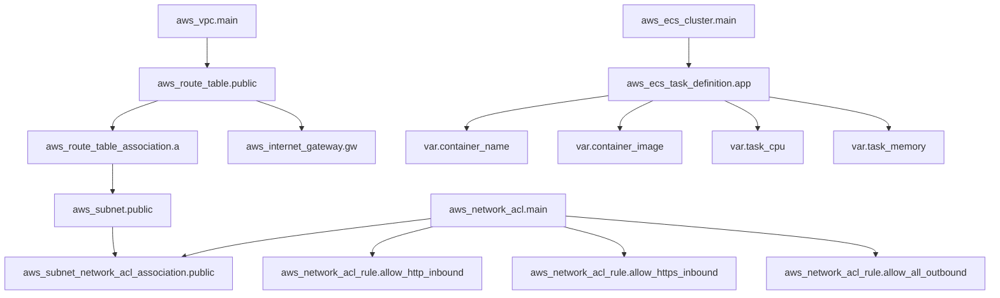

# Steps for validating Terraform code

1. tflint
2. terraform validate
3. terraform plan

```mermaid
graph TD
    A[aws_vpc.main] --> B[aws_route_table.public]
    B[aws_route_table.public] --> C[aws_route_table_association.a]
    C[aws_route_table_association.a] --> D[aws_subnet.public]
    B[aws_route_table.public] --> E[aws_internet_gateway.gw]
    F[aws_ecs_cluster.main] --> G[aws_ecs_task_definition.app]
    G[aws_ecs_task_definition.app] --> H[var.container_name]
    G[aws_ecs_task_definition.app] --> I[var.container_image]
    G[aws_ecs_task_definition.app] --> J[var.task_cpu]
    G[aws_ecs_task_definition.app] --> K[var.task_memory]
    L[aws_network_acl.main] --> M[aws_network_acl_rule.allow_http_inbound]
    L[aws_network_acl.main] --> N[aws_network_acl_rule.allow_https_inbound]
    L[aws_network_acl.main] --> O[aws_network_acl_rule.allow_all_outbound]
    D[aws_subnet.public] --> P[aws_subnet_network_acl_association.public]
    L[aws_network_acl.main] --> P[aws_subnet_network_acl_association.public]
```